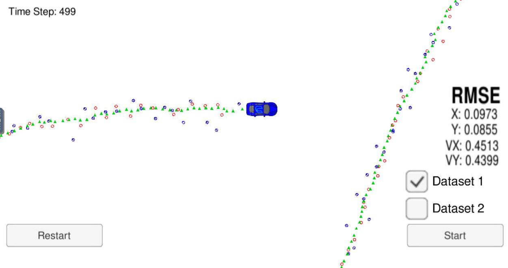
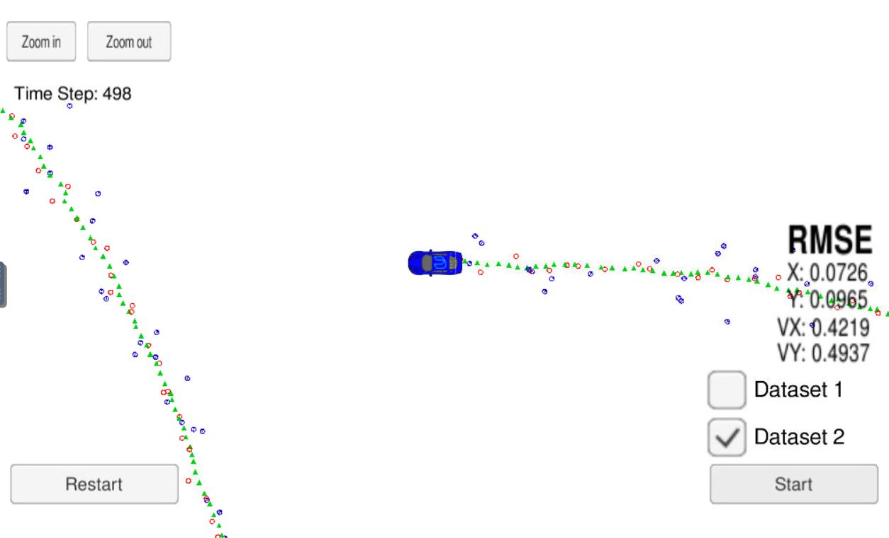

# CarND-Extended-Kalman-Filter-P1
Self-Driving Car Engineer Nanodegree Program - Extended Kalman Filter C++ Implementation

# Overview
In this project we utilize a kalman filter to estimate the state of a moving object of interest with noisy lidar and radar measurements.

This project involves the use of a Simulator which can be downloaded [here](https://github.com/udacity/self-driving-car-sim/releases)

This repository includes two files that can be used to set up and install [uWebSocketIO](https://github.com/uWebSockets/uWebSockets) for either Linux or Mac systems. For windows you can use either Docker, VMware, or even [Windows 10 Bash on Ubuntu](https://www.howtogeek.com/249966/how-to-install-and-use-the-linux-bash-shell-on-windows-10/) to install uWebSocketIO. Please see [this concept in the classroom](https://classroom.udacity.com/nanodegrees/nd013/parts/40f38239-66b6-46ec-ae68-03afd8a601c8/modules/0949fca6-b379-42af-a919-ee50aa304e6a/lessons/f758c44c-5e40-4e01-93b5-1a82aa4e044f/concepts/16cf4a78-4fc7-49e1-8621-3450ca938b77) for the required version and installation scripts.

INPUT: values provided by the simulator to the c++ program

["sensor_measurement"] => the measurement that the simulator observed (either lidar or radar)

OUTPUT: values provided by the c++ program to the simulator

["estimate_x"] <= kalman filter estimated position x
["estimate_y"] <= kalman filter estimated position y
["rmse_x"]
["rmse_y"]
["rmse_vx"]
["rmse_vy"]

---

## Other Important Dependencies

* cmake >= 3.5
  * All OSes: [click here for installation instructions](https://cmake.org/install/)
* make >= 4.1 (Linux, Mac), 3.81 (Windows)
  * Linux: make is installed by default on most Linux distros
  * Mac: [install Xcode command line tools to get make](https://developer.apple.com/xcode/features/)
  * Windows: [Click here for installation instructions](http://gnuwin32.sourceforge.net/packages/make.htm)
* gcc/g++ >= 5.4
  * Linux: gcc / g++ is installed by default on most Linux distros
  * Mac: same deal as make - [install Xcode command line tools](https://developer.apple.com/xcode/features/)
  * Windows: recommend using [MinGW](http://www.mingw.org/)

## Basic Build Instructions

1. Clone this repo.
2. Make a build directory: `mkdir build && cd build`
3. Compile: `cmake .. && make` 
   * On windows, you may need to run: `cmake .. -G "Unix Makefiles" && make`
4. Run it: `./ExtendedKF `

## [Rubric](https://review.udacity.com/#!/rubrics/1962/view) points
### Compiling
#### - The code should comile
If following the basic build instructions, the code should compile with no issues. please contact me if you see otherwise.
### Accuracy
#### - px, py, vx, vy output coordinates must have an RMSE <= [.11, .11, 0.52, 0.52] 
When running th simulator on both datasets I get the follwing results:

The measured accuracy of my implementation of Extended Kalman Filter is below the requested threshold.

### Follows the Correct Algorithm
#### - Sensor Fusion algorithm follows the general processing flow as taught in the preceding lessons
The way that I do sensor fusion is described in [src/FusionEKF.cpp](./src/FusionEKF.cpp). The general flow is:
1. Initialize all sensor parameters.
2. Update state matrixes according to the current dt.
3. Predict next state according to priors.
4. Update the state (according to sensor type)

#### - Kalman Filter algorithm handles the first measurements appropriately.
The first measurement is handled in  [src/FusionEKF.cpp](./src/FusionEKF.cpp) (lines 71-102). the first measurment is treated according to the sensor type. we do not perform prediction or update for the first measurement.

#### - Kalman Filter algorithm first predicts then updates.
Indeed, my implementation calls for the Predict() method before it performs an update.

#### - Kalman Filter can handle radar and lidar measurements.
In [src/FusionEKF.cpp](./src/FusionEKF.cpp) (lines 152-162), you can see that the are different behaviours when we get data from each sensor type.
* For LIDAR data we use regular linear update. described in [src/kalman_filter.cpp](./src/kalman_filter.cpp) (lines 32-50)
* For RADAR data we linearize the data by calculating the Jacobian matrix and update the state with the Extended Kalman Filter equations [src/kalman_filter.cpp](./src/kalman_filter.cpp) (lines 52-91)

### Code Efficiency
#### - Algorithm should avoid unnecessary calculations.
I tried to make the code more efficient by making sure that more complicated calculations will be done only once, saved into a variable, and then be reused if needed. An example of this approach can be seen in [src/tools.cpp](./src/tools.cpp) (lines 51-84) where the Jacobian is calculated. The square root operation is done only once and saved into "c2" (line 69) which later is reused to canstruct the matrix.

